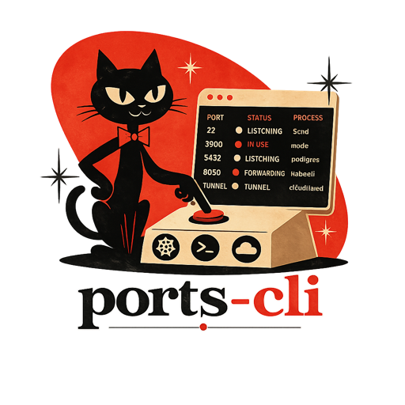
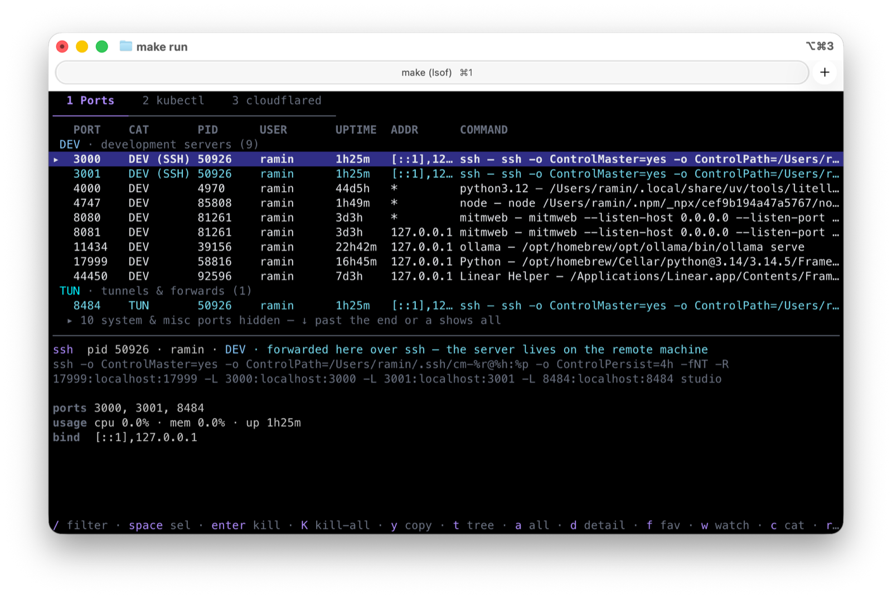

<p align="center">
  
</p>

<h1 align="center">ports-cli</h1>

<p align="center">
  <b>See what's listening. Reclaim the port. One keypress.</b><br>
  An interactive TCP port manager for your terminal — with managed
  <code>kubectl port-forward</code> sessions and Cloudflare Tunnel visibility.
</p>

<p align="center">
  <a href="https://github.com/dupe-com/ports-cli/actions/workflows/ci.yml"></a>
  <a href="https://goreportcard.com/report/github.com/dupe-com/ports-cli"></a>
  <a href="LICENSE"></a>
</p>

<p align="center">
  <a href="#install">Install</a> •
  <a href="#features">Features</a> •
  <a href="#usage">Usage</a> •
  <a href="#configuration">Configuration</a> •
  <a href="#how-it-works">How it works</a> •
  <a href="#development">Development</a>
</p>

---

You run `bun dev` and ports 3000, 3001, and 8484 are "in use". By what?
An orphaned SSH tunnel? Yesterday's dev server? `ports` answers in one
screen and clears it in one keypress.

<p align="center">
  
</p>

## Install

```sh
# Homebrew (macOS / Linux)
brew install dupe-com/tap/ports-cli

# Go
go install github.com/dupe-com/ports-cli/cmd/ports@latest

# curl (downloads the right release binary to /usr/local/bin)
curl -fsSL https://raw.githubusercontent.com/dupe-com/ports-cli/main/install.sh | sh
```

Or grab a binary from [Releases](https://github.com/dupe-com/ports-cli/releases).
Every method installs the binary as **`ports`**.

## Features

- ⚡ **Live table of every listening TCP port** — process, owner, uptime,
  CPU/mem, bind address. Auto-refreshes (configurable, pausable).
- 🎯 **Focus mode by default** — the list is grouped by category (dev servers
  first), and system daemons / unclassified ports are folded away until you
  scroll past the end or press `a`. The ports you're hunting for, not 30 rows
  of `rapportd`.
- 🔪 **One-keypress kill** — graceful `SIGTERM` with a grace window, `F` to
  escalate to `SIGKILL`. Multi-select with `space`, or `K` to clear
  everything visible at once.
- 🔍 **Fuzzy filter** (`/`) across port, process name, user, and full command
  line — plus a category filter (`c`) that cycles dev / web / db / messaging /
  tunnel / system. Filters always search everything, folded or not.
- 🏷️ **Smart categorization** — postgres on a weird port is still a `DB`;
  rules match the process first, well-known ports second. SSH forwards are
  carriers: an `ssh -L` of your dev server shows as `DEV (SSH)` in a distinct
  tint, and unrecognized forwarded ports get their own always-visible
  `TUN · tunnels & forwards` group.
- 🌳 **Tree view** (`t`) — group ports by owning process instead.
- ★ **Favorites** — pin the ports you care about to the top of their group.
- 👁️ **Watched ports** — get a desktop notification when a port starts or
  stops listening ("tell me when the dev server is actually up").
- 📋 **Copy** (`y`) — put `localhost:PORT` on the clipboard.
- ☸️ **Managed `kubectl port-forward` sessions** — create from a form, watch
  status live, view logs, and let them **auto-reconnect with backoff** when
  the connection drops. Save specs (`s`) to relaunch them in one keypress
  next session. No more dead forwards after a pod restart.
- ☁️ **Cloudflare Tunnel visibility** — see every running `cloudflared`,
  named or quick, with its origin and config. (Tunnels dial out, so they
  never show up in a port scan — this tab is how you see them.)
- 🤖 **Scriptable** — every feature has a flag-driven subcommand with
  `--json` output where it matters.

## Usage

### TUI

```sh
ports
```

| Key | Action |
| --- | --- |
| `1` `2` `3` / `←→` / `tab` | switch tabs (Ports / kubectl / cloudflared) |
| `↑↓` `j` `k` | move · `g`/`G` top/bottom |
| `a` | reveal/fold system & misc ports (`↓` past the end also reveals) |
| `/` | fuzzy filter |
| `c` | cycle category filter |
| `space` | multi-select |
| `enter` / `x` | kill — confirm with `y` (graceful) or `F` (force) |
| `K` | kill everything visible (with confirmation) |
| `y` | copy `localhost:PORT` to clipboard |
| `t` | tree view — group ports by owning process |
| `d` | hide/show detail pane (full cmdline, all ports held by the pid) |
| `f` / `w` | toggle favorite ★ / watched 👁 |
| `r` / `p` | refresh now / pause auto-refresh |
| `n` / `s` / `D` | (kubectl tab) new forward / save spec / delete saved spec |
| `esc` | back out one layer: filter → fold → quit |
| `?` | help |

### CLI

```sh
ports list                        # table of all listeners
ports list --json                 # same, as JSON
ports list --category db          # only databases
ports list --filter node          # name/cmdline substring

ports kill 3000                   # kill whatever holds :3000 (confirms)
ports kill 3000 8080 --yes        # no confirmation
ports kill node --force           # by name, SIGTERM → SIGKILL

ports watch 3000                  # notify when :3000 starts/stops listening
ports watch 3000 5432 --interval 1s

ports fwd svc/api 8080:80         # kubectl port-forward that auto-reconnects
ports fwd pod/web-0 3000 -n staging --context prod
```

## Configuration

`~/.config/ports-cli/config.toml` (created on first favorite/watch; all keys
optional):

```toml
refresh_interval = "2s"     # TUI auto-refresh; "0" disables
grace_period = "1500ms"     # SIGTERM → SIGKILL window
notify = true               # desktop notifications
favorites = [3000, 5432]
watched = [8080]

# saved kubectl port-forward specs (press s on a running session to add)
[[forwards]]
target = "svc/api"
ports = ["8080:80"]
namespace = "staging"
```

Override the location with `$PORTS_CLI_CONFIG`.

## How it works

- **Discovery** — `lsof` field-output on macOS (the most reliable
  unprivileged source there), gopsutil's connection table elsewhere. You see
  the processes your user can see; run with `sudo` to see everything.
- **Categorization** — process-name rules first, well-known-port rules second.
  `ssh`/`autossh` are *carriers*: their name says nothing about what the port
  is for, so the port rule decides (`3000` forwarded over ssh is still `DEV`),
  and unmatched carried ports become `TUN` instead of being mistaken for
  system noise.
- **Kill** — `SIGTERM`, a grace window for clean shutdown, then opt-in
  `SIGKILL` for survivors. Multi-port processes are signalled once.
- **Forward sessions** — children of the TUI/CLI process, supervised with
  exponential backoff (1s → 30s cap), reset on successful reconnect. They end
  when `ports` does — no daemons, no state files.
- **Tunnels** — read-only detection of `cloudflared` processes via the
  process table.

## Development

```sh
make build      # build ./bin/ports
make test       # go test ./...
make lint       # golangci-lint (or go vet fallback)
make snapshot   # goreleaser snapshot build
```

See [CONTRIBUTING.md](CONTRIBUTING.md).

## Related

ports-cli grew out of the port-killer script in
[**agent-mac-ops**](https://github.com/dupe-com/agent-mac-ops) — a toolkit for
operating an always-on Mac remotely (agent-driven ops, native terminal
sessions, browser/clipboard handoff, port forwarding). If you're clearing
ports on a remote dev box over ssh, you probably want both: agent-mac-ops
creates the forwards, ports-cli is how you see them (`DEV (SSH)` rows).

## License

[MIT](LICENSE) © Dupe, Inc.
